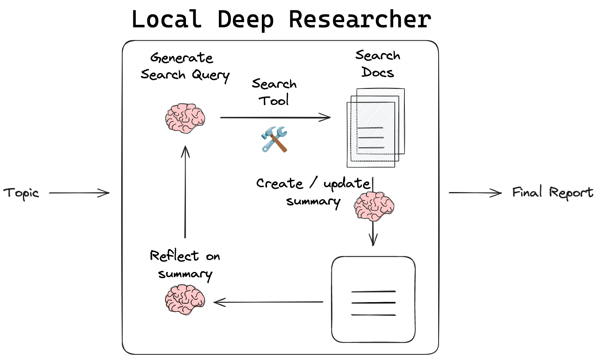
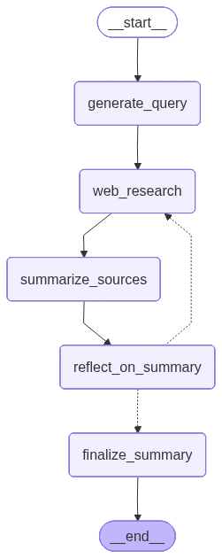
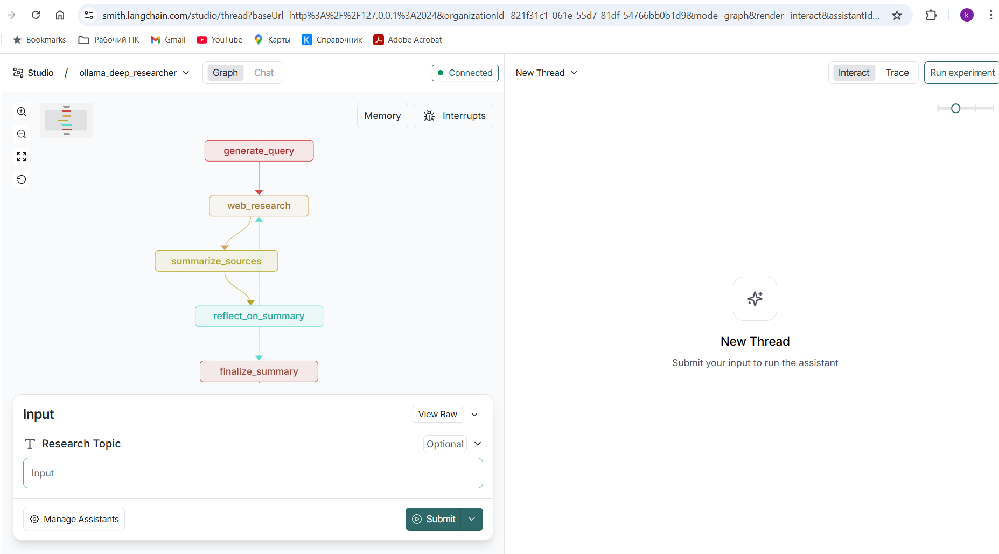
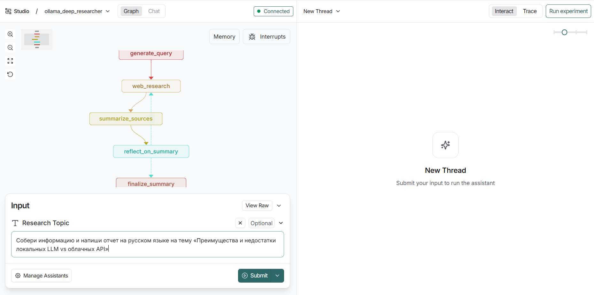
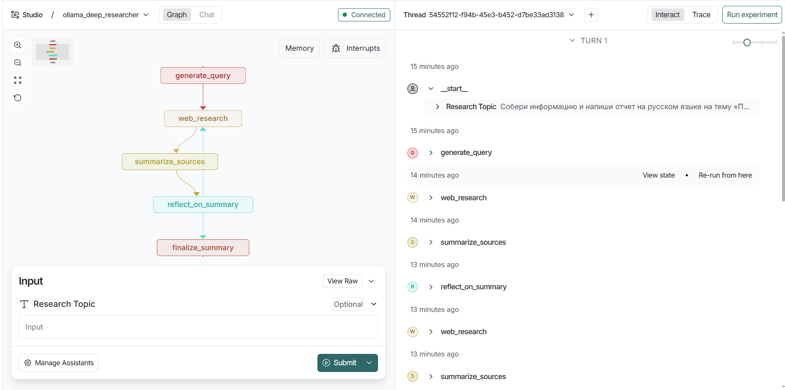
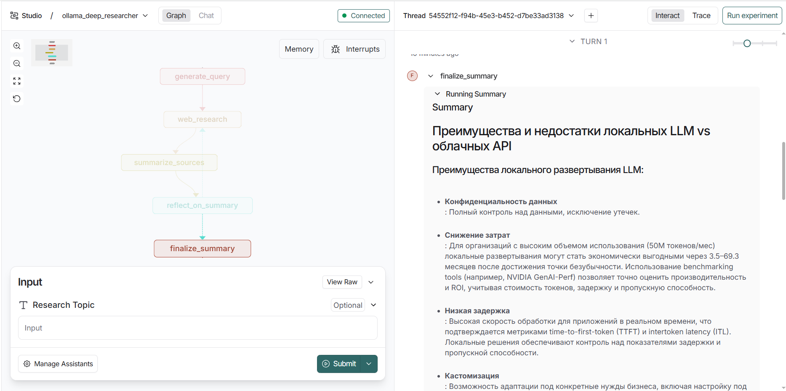

# LocalDeepResearcher_01


# 🧠 Local Deep Researcher (локальный глубокий исследователь)



**Local Deep Researcher** — это полностью локальный ассистент для веб-исследований и написания отчётов, построенный на базе **LangGraph** и **локальных LLM** (через **Ollama** или **LMStudio**).

Дайте ему тему исследования — и он сам:

- сгенерирует поисковые запросы;
- выполнит несколько циклов веб-поиска;
- законспектирует найденные материалы;
- найдёт пробелы в понимании темы;
- задаст дополнительные уточняющие запросы;
- соберёт финальный **markdown-отчёт** с ссылками на источники.

Репозиторий GitHub (оригинал):  
<https://github.com/langchain-ai/local-deep-researcher>

Видео (English 15 минут) Building a fully local research assistant from scratch with Ollama:
<https://youtu.be/XGuTzHoqlj8?si=3Tv513xJJg-ydIz7>

Конспект (English):
<https://mirror-feeling-d80.notion.site/Fully-Local-Research-Summarization-157808527b1780bfa5e5f4650630ae08>

---

## ✨ Основные возможности

- 🔒 **Полностью локальная LLM**  
  Модель работает через **Ollama** или **LMStudio**. 

- 🌐 **Гибкий веб-поиск**
  - По умолчанию — **DuckDuckGo** (без API-ключей).
  - Дополнительно поддерживаются:
    - **SearXNG**,
    - **Tavily**,
    - **Perplexity**.  
  Выбор задаётся в `.env` через `SEARCH_API`.


- 🕸 **Итеративный Deep Research-подход**  
  Подход вдохновлён работами типа **IterDRAG**:
  - тема разбивается на подзапросы,
  - для каждого подзапроса ищутся документы,
  - формируются частичные ответы,
  - выявляются пробелы в знаниях,
  - строятся новые уточняющие запросы,
  - итоговый отчёт собирается из нескольких итераций.


- 🧩 **LangGraph-граф с визуальным интерфейсом**  
  Процесс реализован как граф в **LangGraph**.  
  Через **LangGraph Studio** можно:
  - наблюдать ход выполнения графа;
  - смотреть состояние (state) и список собранных источников;
  - просматривать финальный отчёт.


- 📦 **Готов к развёртыванию**  
  В репозитории есть:
  - `langgraph.json` — описание графа,
  - `pyproject.toml` — зависимости,
  - `Dockerfile` — запускает LangGraph-сервис с этим графом,
  - `.env.example` — пример конфигурации.

---

## 🧱 Архитектура (высокоуровневое описание)

Local Deep Researcher — это LangGraph-граф, который объединяет:



1. **Узел генерации поискового запроса**  
   - получает тему исследования от пользователя;
   - с помощью локальной LLM формулирует текст запроса к веб-поиску.


2. **Узел веб-поиска**  
   - обращается к выбранному API (`duckduckgo`, `tavily`, `perplexity`, `searxng`);
   - возвращает список ссылок + (опционально) полный текст страниц.


3. **Узел суммаризации**  
   - читает результаты поиска;
   - извлекает ключевые тезисы;
   - формирует промежуточный обзор в виде markdown.


4. **Узел рефлексии**  
   - анализирует текущий обзор;
   - выявляет, какой важной информации ещё не хватает;
   - формирует новый поисковый запрос, закрывающий пробелы.


5. **Циклический контур**  
   - граф повторяет: поиск → суммаризация → рефлексия;
   - количество циклов настраивается переменной `MAX_WEB_RESEARCH_LOOPS`.


6. **Узел финального отчёта**  
   - собирает все накопленные заметки, источники и промежуточные выводы;
   - формирует итоговый markdown-отчёт с цитированием источников;
   - помещает отчёт в состояние графа, доступное через LangGraph Studio.

---

# 🧩  Краткий обзор кода

Ниже приведён обзор модулей и ключевой логики проекта, чтобы упростить погружение в кодовую базу.

---

## **1. `configuration.py` — Конфигурация проекта**

Содержит класс **`Configuration`**, который:

* загружает настройки из `.env` и параметров запуска;
* определяет:

  * модель LLM (`local_llm`);
  * провайдер (`ollama` или `lmstudio`);
  * поисковый API (`duckduckgo`, `tavily`, `perplexity`, `searxng`);
  * глубину ресёрча (`max_web_research_loops`);
  * URL-адрес локального LLM;
  * включение tool calling или JSON-mode.

Также содержит перечисление **`SearchAPI`** и фабрику `from_runnable_config()`.

---

## **2. `lmstudio.py` — Интеграция с LMStudio**

Расширяет класс `ChatOpenAI`, создавая адаптер **ChatLMStudio**, который:

* совместим с LMStudio API (`http://localhost:1234/v1`);
* поддерживает `format="json"` — JSON mode как у OpenAI GPT;
* делает автодочистку JSON-ответов;
* логирует сырые ответы для диагностики.

Используется, если в конфигурации выбран провайдер `lmstudio`.

---

## **3. `state.py` — Формат хранимого состояния**

Определяет классы:

* `SummaryState` — состояние узлов графа:

  * тема исследования,
  * поисковый запрос,
  * результаты веб-поиска,
  * промежуточные источники,
  * итоговый отчёт.

* `SummaryStateInput` / `SummaryStateOutput` — вход и выход графа.

State работает как глобальная память между шагами графа.

---

## **4. `prompts.py` — Промпты для LLM**

Содержит все шаблоны инструкций:

* `query_writer_instructions` — генерация поискового запроса;
* `summarizer_instructions` — суммаризация найденных источников;
* `reflection_instructions` — поиск пробелов в знаниях;
* версии под JSON-mode и ToolCalling-mode.

Также содержит утилиту `get_current_date()`.

---

## **5. `utils.py` — Утилиты веб-поиска и обработки данных**

Основные функции:

### 🔍 Веб-поиск

* `duckduckgo_search`
* `tavily_search`
* `perplexity_search`
* `searxng_search`

Любой из этих API может быть выбран пользователем.

### 🧹 Обработка результатов

* `deduplicate_and_format_sources()` — сохраняет контент источников, удаляет дубли;
* `format_sources()` — компактный список ссылок.

### 🧽 Фильтрация

* `strip_thinking_tokens()` — удаляет `<think>`-токены моделей deepseek-r1.

---

## **6. `graph.py` — Основная логика Local Deep Researcher**

Это центральный файл проекта.
Содержит:

### **Узлы графа:**

1. **`generate_query()`**
   Использует LLM → создаёт поисковый запрос.

2. **`web_research()`**
   Делает реальный веб-поиск через выбранный API.

3. **`summarize_sources()`**
   Обновляет промежуточный обзор (running summary).

4. **`reflect_on_summary()`**
   Находит пробелы, генерирует уточняющий запрос.

5. **`finalize_summary()`**
   Собирает итоговый markdown-отчёт и
   ➜ **сохраняет его в файл `report.md`**.

### **Маршрутизация:**

`route_research()` управляет циклом:

```
query → search → summary → reflection → (loop)
```

Количество циклов задаётся через `MAX_WEB_RESEARCH_LOOPS`.

### **Построение графа:**

Используется:

```python
StateGraph(...)
.add_node(...)
.add_edge(...)
.compile()
```

Граф автоматически отображается в **LangGraph Studio**.


---

## ⚙️ Установка и запуск

## Предварительные требования

- Python 3.11+
- Ollama (установленный и запущенный)
- Виртуальное окружение Python (рекомендуется)

## Структура проекта

```
LocalDeepResearcher_01/
├── venv/
├── local-deep-researcher/
│   ├── graph.py
│   ├── configuration.py
│   ├── lmstudio.py
│   ├── prompts.py
│   ├── state.py
│   ├── utils.py
│   └── ...
│   └── requirements.txt


```

## Примечания

- Проект использует LangGraph для построения агентов
- Поддерживается работа с локальными LLM через Ollama
- Включена поддержка поиска через Tavily или DuckDuckGo
- Установлены все необходимые зависимости для исследовательского агента

---

## Установка и настройка

### 1. Активация виртуального окружения
```bash
# Windows
C:\_AI\DeepAgents_01\venv\Scripts\activate

# Linux/Mac
source venv/bin/activate
```

### 2. Обновление pip

```bash
python.exe -m pip install --upgrade pip
```

### 3. Клонирование репозитория

```bash
git clone https://github.com/langchain-ai/local-deep-researcher.git
cd local-deep-researcher
```

### 4. Проверка доступных моделей Ollama

```bash
ollama list
```

### 5. Загрузка модели deepseek-r1 (если не установлена)

```bash
ollama pull deepseek-r1:8b
```

### 6. Установка зависимостей проекта

```bash
pip install -e .
```

### 7. Установка LangGraph CLI

```bash
pip install -U "langgraph-cli[inmem]"
```

### 8. Настройка .env

См. `.env.example` — пример конфигурации.

```
# Which search service to use, either 'duckduckgo', 'tavily', 'perplexity', Searxng
SEARCH_API='duckduckgo'
# For Searxng search, defaults to http://localhost:8888
SEARXNG_URL=

# Web Search API Keys (choose one or both)
TAVILY_API_KEY=tvly-xxxxx      # Get your key at https://tavily.com
PERPLEXITY_API_KEY=pplx-xxxxx  # Get your key at https://www.perplexity.ai

# LLM Configuration
LLM_PROVIDER=lmstudio          # Options: ollama, lmstudio
LOCAL_LLM=qwen_qwq-32b         # Model name in LMStudio/Ollama
LMSTUDIO_BASE_URL=http://localhost:1234/v1  # LMStudio OpenAI-compatible API URL
OLLAMA_BASE_URL=http://localhost:11434 # the endpoint of the Ollama service, defaults to http://localhost:11434 if not set

MAX_WEB_RESEARCH_LOOPS=3
FETCH_FULL_PAGE=True
```

### 9. Запуск разработческого сервера

```bash
langgraph dev
```

## Примеры:









Полученный отчет: [report.md](report.md)

---
# 🔧 Как расширить граф агента

Эта система легко модифицируется — LangGraph позволяет добавлять новые узлы и маршруты.

Ниже несколько идей:

---

## 📌 1. Добавить новый тип веб-поиска
Пример: интеграция Bing API.

- реализуем функцию `bing_search(query)`,
- добавляем её в `utils.py`,
- регистрируем в `web_research()`:

```python
elif search_api == "bing":
    search_results = bing_search(state.search_query)
````

* добавляем выбор в `Configuration.search_api`.

---

## 📌 2. Добавить узел «Классификация источников»

Пример нового узла:

```python
def classify_sources(state, config):
    # LLM оценивает качество источников
    ...
    return {"classified_sources": results}
```

Добавляем в граф:

```python
builder.add_node("classify_sources", classify_sources)
builder.add_edge("web_research", "classify_sources")
builder.add_edge("classify_sources", "summarize_sources")
```

---

## 📌 3. Добавить узел «Оценка надёжности»

Пример: LLM анализирует источники и выставляет рейтинг доверия.

---

## 📌 4. Включить инструментальный вызов (Tool Calling)

На этапе генерации запроса и рефлексии достаточно в `.env` включить:

```
USE_TOOL_CALLING=true
```

В коде уже всё реализовано.

---

## 📌 5. Добавить экспорт отчёта в PDF

Создать новый узел:

```python
def export_pdf(state):
    markdown_to_pdf(state.running_summary, "report.pdf")
```

Добавить после `finalize_summary`.

---

## 📌 6. Добавить новую роль агента

Можно добавить новых агентов:

* «аналитик»,
* «редактор»,
* «факт-чекер».

Каждый будет отдельным узлом в графе.

---